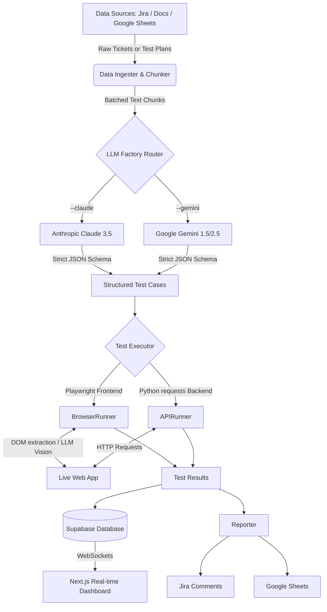
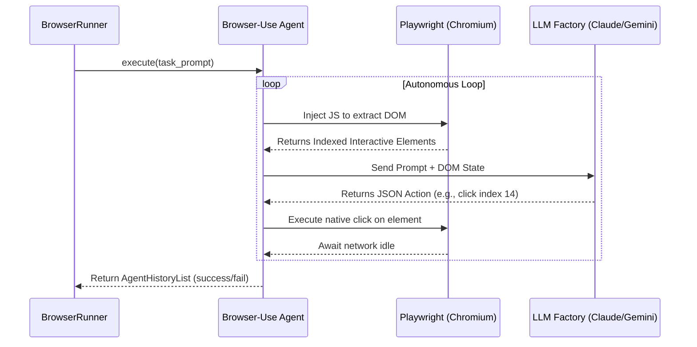
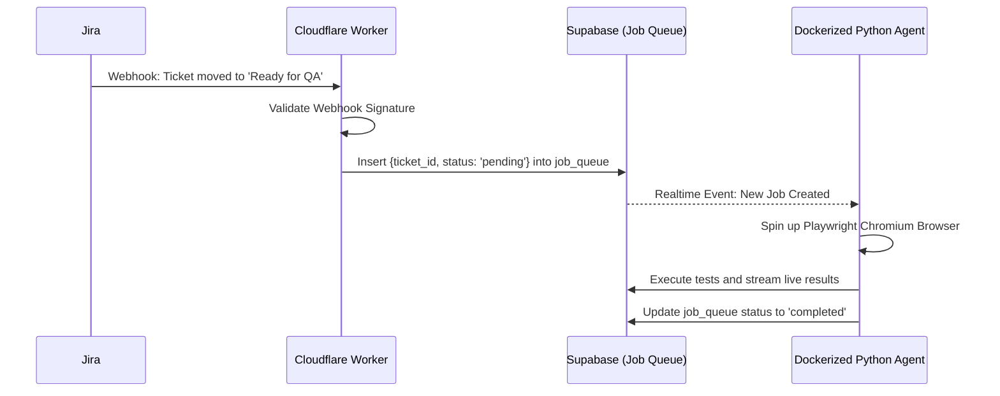

# Autonomous QA Agent: System Architecture

This document provides an in-depth technical overview of the Autonomous QA Agent, detailing its design patterns, execution flows, and integrations.

---

## 1. High-Level Architecture

The system is designed as a pipeline that converts human-readable requirements (from Jira, local files, or massive Test Plan spreadsheets) into deterministic browser actions and API requests, tracking everything in a real-time database.

### Core Philosophy
Traditional automation testing (Selenium, Cypress) relies on hardcoded CSS selectors and exact visual rendering, resulting in brittle tests that break when a button changes color or moves. 

This architecture uses **Visual DOM Understanding** and **Goal-Oriented Action Execution**. The AI is given a goal ("Create a new Todo") and navigates the DOM dynamically, just like a human QA engineer.

---

## 2. Component Breakdown

### A. Data Ingestion & Chunking (`TicketIngester` / `SheetsClient`)
The pipeline begins by fetching unstructured text data representing the work that needs to be tested.
- **Jira Integration:** Uses the Atlassian REST API via JQL queries (e.g., `project=QA AND status='In Progress'`).
- **Google Sheets Test Plans:** Utilizes `InstalledAppFlow` (OAuth 2.0 Desktop Flow) to securely grab entire massive QA spreadsheets. To bypass LLM context limits and rate-limits (especially on Free Tiers), the spreadsheet is automatically tokenized and batched into discrete chunks before being sent to the AI.

### B. AI Test Generation (`TestCaseGenerator` & `LLMClient`)
Raw descriptions are sent to the `LLMClient` factory, which dynamically routes the workload to either Anthropic or Google based on your `.env` defaults or CLI overrides. The LLM acts as a Senior QA Automation Engineer.
- It parses the ticket or massive test plan.
- It breaks the logic down into discrete steps.
- It preserves existing metadata (like `Smoke`, `Regression`, and `Priority` levels).
- It outputs a strictly typed Pydantic model (`TestCase`) ensuring uniform execution downstream.

### C. The Execution Engine (`TestExecutor`)
The executor routes the generated test cases based on their classification (`frontend` vs `backend`).

#### The `browser-use` Engine (Frontend)
The `BrowserRunner` implements the open-source `browser-use` library. This bridges the gap between the LLM and the physical Chromium browser.

**Execution Isolation:** To prevent cross-test contamination and memory leaks, a completely fresh, sandboxed Chromium instance is spun up and destroyed per test case via a strict `try/finally` block.

#### The `APIRunner` (Backend)
For backend tests, standard Python `requests` logic executes CRUD operations against the target endpoints, asserting standard HTTP status codes and JSON payload structures.

---

### D. The Cloudflare Worker (API Middle-Tier)
While the Next.js dashboard reads directly from Supabase for real-time WebSocket speed, the architecture includes a Cloudflare Worker `worker/` directory for production-grade scaling and security.
- **Webhook Processing (Event-Driven Architecture):** A Python script cannot listen for inbound internet requests easily. The Worker acts as an always-online edge endpoint to catch webhooks (e.g., when a Jira ticket enters the "QA" column) to automatically trigger the pipeline.
- **Security & Proxying:** Prevents exposing highly sensitive `JIRA_API_TOKEN` keys to the Next.js client if the dashboard needs to fetch external metadata.
- **Edge Caching:** Handles heavy read requests and caches them at the network edge to prevent overwhelming the Supabase database and racking up compute costs.

---

## 3. Event-Driven Production Architecture
While the agent is run manually via the CLI during local development, a true production deployment fully automates the testing lifecycle.

1. **The Trigger:** The Cloudflare Worker is deployed publicly. It exposes a `POST /webhook/jira` route to listen for Jira status changes.
2. **The Queue:** To prevent DDOSing the LLM or crashing the browser, the Worker does not call the agent directly. It simply drops the job into a Supabase `job_queue` table.
3. **The Execution Engine:** The Python `agent/` folder is packaged into a Docker container and hosted on a persistent VM or serverless container service (AWS Fargate/GCP Cloud Run). It securely listens to Supabase for inbound jobs, executes them one by one, and pushes results to the dashboard without ever exposing itself directly to the public internet.

---

## 4. Reporting & Telemetry

### The Supabase Database
Every execution is recorded in a PostgreSQL database hosted by Supabase.
- `test_runs`: Tracks the overarching execution pipeline (Start Time, Total Tests, Total Duration).
- `test_cases`: The LLM-generated JSON steps.
- `test_results`: The final pass/fail status, duration, and stringified console logs of what the agent physically did on the screen.

### The Next.js Dashboard
The dashboard uses the `src/app` Next.js router and TailwindCSS. It utilizes **Supabase Realtime WebSockets** (`supabase.channel('postgres_changes')`) to actively listen to database inserts. When the Python agent completes a test step, the Next.js UI updates instantly without a page refresh.

### The Jira Reporter
Once execution finishes, the `Reporter` class aggregates the results, looks up the original Ticket ID, and uses the Atlassian Document Format (ADF) API to inject a formatted summary comment (Pass/Fail metrics and execution logs) directly onto the Jira Agile Board.
