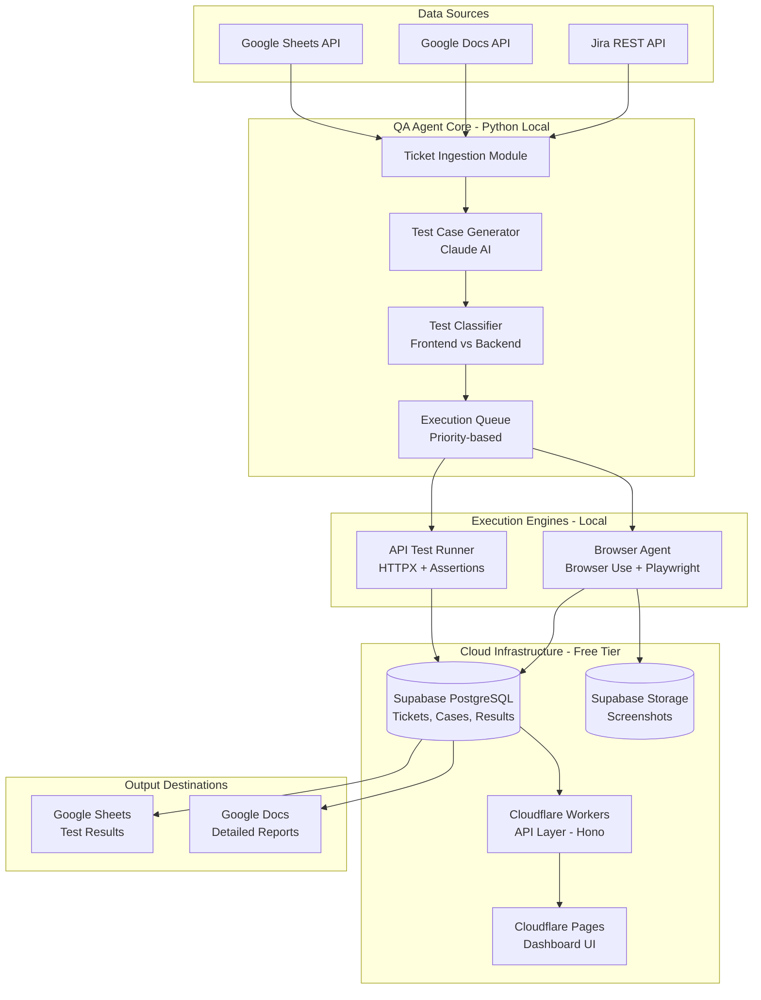
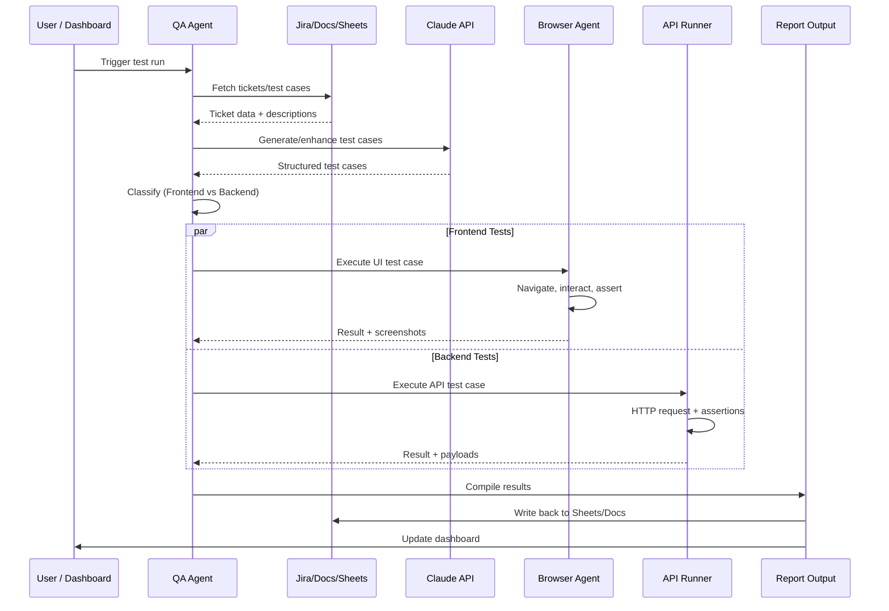
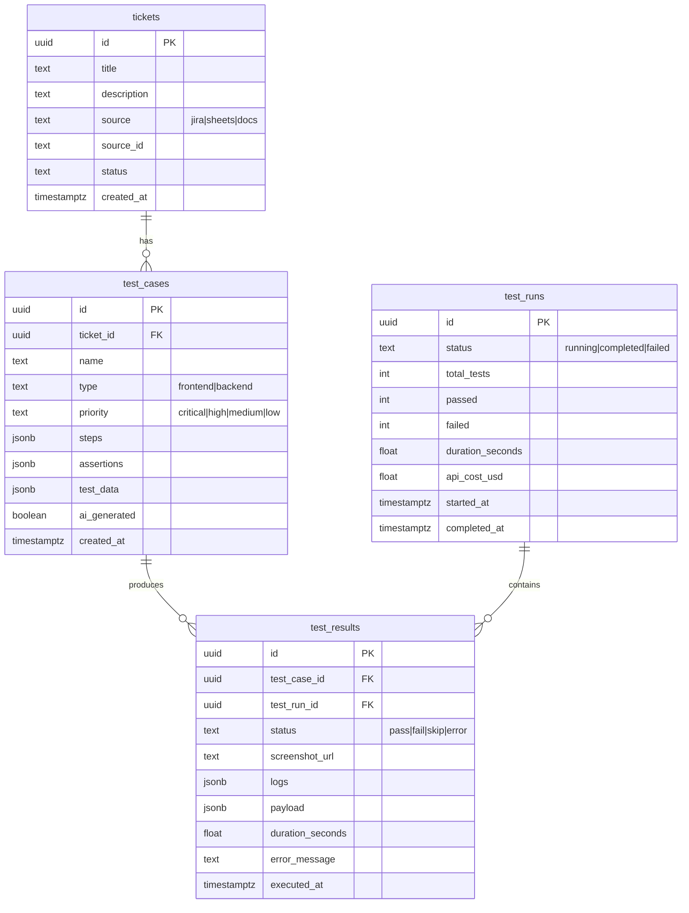
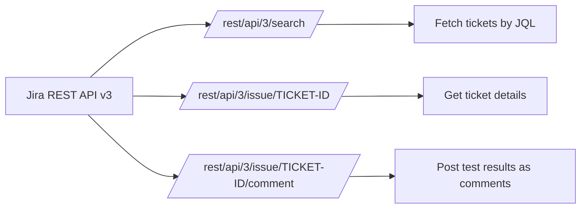
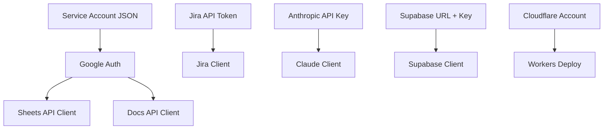
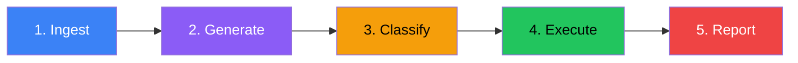
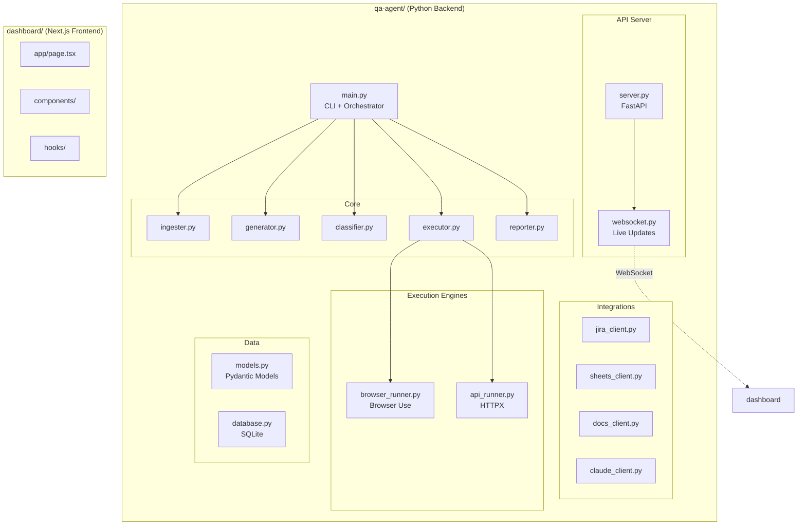

# 🤖 QA Automation Agent — Implementation Plan

## Table of Contents
1. [Project Overview](#project-overview)
2. [Architecture](#architecture)
3. [Technology Stack](#technology-stack)
4. [Browser Agent Selection](#browser-agent-selection)
5. [Integration Design](#integration-design)
6. [UI/UX Design System](#uiux-design-system)
7. [Core Agent Pipeline](#core-agent-pipeline)
8. [Module Breakdown](#module-breakdown)
9. [File Structure](#file-structure)
10. [5-Day Development Plan](#5-day-development-plan)
11. [Budget Allocation](#budget-allocation)
12. [Known Limitations](#known-limitations)

---

## Project Overview

Build an **autonomous QA agent** that:
- Pulls tickets from **Jira / Google Docs / Sheets**
- Generates or fetches **test cases** (using Claude AI)
- **Classifies** test cases as frontend (UI) or backend (API)
- **Executes** tests autonomously — browser agent for frontend, HTTP client for backend
- **Reports results** with screenshots, logs, and pass/fail status back to Google Sheets/Docs

**Target App:** [https://qa-assignment-steel.vercel.app/](https://qa-assignment-steel.vercel.app/)
- A Next.js todo app with auth, per-user todos (priority, due date, CRUD, filter)
- Seeded accounts: `admin1@example.com`, `bob@example.com`, `admin2@admin.com`

---

## Architecture



### Data Flow



---

## Technology Stack

| Layer | Technology | Justification |
|-------|-----------|---------------|
| **Agent Language** | Python 3.12+ | Best ecosystem for AI agents, Browser Use is Python-native |
| **AI Model** | Anthropic Claude (Sonnet) | Budget-optimized ($60 credits), excellent at test generation |
| **Browser Automation** | Browser Use + Playwright | Autonomous reasoning, Python-native, local execution |
| **API Testing** | HTTPX + Pydantic | Async HTTP client with response validation |
| **Backend API** | Cloudflare Workers + Hono | Free tier (100K req/day), edge deployment, zero cold starts |
| **Database** | Supabase (PostgreSQL) | Free tier (500MB DB, 1GB storage), real-time subscriptions, REST API |
| **Dashboard** | Next.js 15 + React 19 | Modern, deploys to Cloudflare Pages |
| **Styling** | Tailwind CSS + shadcn/ui | Developer-tool aesthetic, dark mode native |
| **Charts** | Recharts | Test result visualization |
| **Queue** | Python asyncio + priority queue | Lightweight, no external deps |
| **Deployment** | Cloudflare Pages + Workers | Free, global CDN, instant deploys |

---

## Browser Agent Selection

### 🏆 Recommendation: **Browser Use**

| Criteria | Browser Use ✅ | Stagehand |
|----------|---------------|-----------|
| **Language** | Python (native) | TypeScript (primary), Python wrapper |
| **Autonomy** | Full autonomous reasoning loop | Hybrid code + natural language |
| **Cost** | 100% free, runs locally | Free SDK, but Browserbase cloud costs extra |
| **Claude Support** | Native Anthropic integration | Native multi-LLM support |
| **Screenshots** | Built-in screenshot capture | Built-in |
| **Local Execution** | ✅ Full local Playwright | ✅ Local possible, cloud recommended |
| **QA Suitability** | Excellent for exploration | Better for known workflows |
| **Community** | 97K+ GitHub stars | ~3.4K stars |
| **Cost Tracking** | Built-in `calculate_cost=True` | Manual tracking |
| **Retry/Flakiness** | `max_failures` param built-in | Self-healing via caching |

### Why Browser Use Wins for This Project

1. **Autonomous Exploration** — The assignment says _"Discover the app's features... the way a QA hire onboarding to an unfamiliar product would."_ Browser Use's autonomous reasoning loop is perfect for this — it can explore, observe DOM, plan actions, and execute without predefined scripts.

2. **Python Native** — The agent core is Python; Browser Use integrates without any bridge layer.

3. **Zero Cloud Cost** — Runs entirely locally with Playwright. Stagehand recommends Browserbase cloud which would eat into the $60 budget.

4. **Built-in Budget Control** — `calculate_cost=True` tracks token spend per run. Critical with a $60 cap.

5. **Massive Community** — 97K+ GitHub stars vs ~3.4K for Stagehand means more examples, faster bug fixes, and better documentation.

6. **DOM-First Approach** — Saves 80-90% tokens compared to vision-only approaches. The agent reads DOM structure rather than screenshots for most decisions.

### Browser Use Integration Pattern

```python
from browser_use import Agent, Browser, BrowserConfig
from langchain_anthropic import ChatAnthropic

# Configure with Anthropic Claude
llm = ChatAnthropic(
    model="claude-sonnet-4-20250514",
    api_key="sk-ant-..."
)

# Create browser agent with cost tracking
browser = Browser(config=BrowserConfig(headless=False))
agent = Agent(
    task="Navigate to the todo app, login as admin1, create a todo with high priority",
    llm=llm,
    browser=browser,
    max_failures=3  # Built-in retry on failure
)

# Execute and get results with cost tracking
result = await agent.run()
print(f"Cost: ${result.total_cost():.4f}")
```

---

## Integration Design

### Supabase Database

> **Free Tier:** 500MB database, 1GB file storage, 50K monthly active users, unlimited API requests



**Why Supabase over SQLite:**
| Feature | Supabase ✅ | SQLite |
|---------|------------|--------|
| Accessible from dashboard | ✅ Via REST API | ❌ Local file only |
| Real-time subscriptions | ✅ Built-in | ❌ Requires polling |
| Multi-device access | ✅ Cloud-hosted | ❌ Single machine |
| File storage (screenshots) | ✅ Supabase Storage | ❌ Local disk |
| Free tier | 500MB DB, 1GB storage | Unlimited (local) |
| Shareable with evaluators | ✅ Just add email | ❌ Must share file |

### Cloudflare Workers API

> **Free Tier:** 100K requests/day, 10ms CPU per request, global edge deployment

**Framework:** [Hono](https://hono.dev) — lightweight, fast, perfect for Workers

```typescript
// worker/src/index.ts
import { Hono } from 'hono'
import { cors } from 'hono/cors'
import { createClient } from '@supabase/supabase-js'

const app = new Hono()
app.use('*', cors())

// Fetch test runs with results
app.get('/api/runs', async (c) => {
  const supabase = createClient(c.env.SUPABASE_URL, c.env.SUPABASE_KEY)
  const { data } = await supabase
    .from('test_runs')
    .select('*, test_results(*)')
    .order('started_at', { ascending: false })
  return c.json(data)
})

// Receive results from Python agent
app.post('/api/results', async (c) => {
  const body = await c.req.json()
  const supabase = createClient(c.env.SUPABASE_URL, c.env.SUPABASE_KEY)
  const { data } = await supabase
    .from('test_results')
    .insert(body)
  return c.json(data)
})

export default app
```

**Why Cloudflare Workers over FastAPI:**
| Feature | Cloudflare Workers ✅ | FastAPI |
|---------|----------------------|----------|
| Deployment | `wrangler deploy` — 1 command | Need VPS/Docker |
| Cost | Free (100K req/day) | Need server ($5+/mo) |
| Cold starts | 0ms (edge) | ~500ms-2s |
| Global CDN | ✅ Automatic | ❌ Single region |
| HTTPS | ✅ Automatic | Manual cert setup |
| Scaling | ✅ Automatic | Manual |

### Jira Integration



| Endpoint | Method | Purpose |
|----------|--------|---------|
| `/rest/api/3/search` | GET | Fetch tickets via JQL query |
| `/rest/api/3/issue/{id}` | GET | Get full ticket description |
| `/rest/api/3/issue/{id}/comment` | POST | Write test results back |

**Auth:** Basic Auth or API Token (OAuth 2.0 for production)

### Google Sheets Integration

| Operation | API Method | Use Case |
|-----------|-----------|----------|
| Read test cases | `spreadsheets.values.get` | Fetch existing test cases |
| Write results | `spreadsheets.values.append` | Log test run results |
| Create sheet | `spreadsheets.create` | New test run report |
| Format cells | `spreadsheets.batchUpdate` | Color-code pass/fail |

### Google Docs Integration

| Operation | API Method | Use Case |
|-----------|-----------|----------|
| Read tickets | `documents.get` | Fetch ticket descriptions |
| Write report | `documents.batchUpdate` | Detailed test report with screenshots |
| Insert table | `documents.batchUpdate` | Structured results table |

### Authentication Flow



---

## UI/UX Design System

> Generated using the **ui-ux-pro-max** skill with domain searches across `product`, `style`, `color`, `typography`, `chart`, and `ux` databases — plus deep analysis of `design.csv` (1,776 lines), `styles.csv` (86 styles), and `colors.csv` (161 palettes).

### Generate Your Own Design System

Run this command to regenerate or customize:
```bash
# Generate full design system
python skills/ui-ux-pro-max/scripts/search.py "QA testing dashboard developer tool dark mode" --design-system -p "QA Testing Agent"

# Persist as MASTER.md + page overrides
python skills/ui-ux-pro-max/scripts/search.py "QA testing dashboard" --design-system --persist -p "QA Testing Agent" --page "dashboard"

# Supplement with domain-specific searches
python skills/ui-ux-pro-max/scripts/search.py "dashboard monitoring dark" --domain style
python skills/ui-ux-pro-max/scripts/search.py "developer tool IDE" --domain color
python skills/ui-ux-pro-max/scripts/search.py "animation accessibility z-index loading" --domain ux
python skills/ui-ux-pro-max/scripts/search.py "real-time dashboard" --domain chart
```

### Design Philosophy

| Principle | Application |
|-----------|-------------|
| **Product Type** | Developer Tool / IDE → Dark Mode + Minimalism |
| **Dashboard Style** | Real-Time Monitor + Terminal aesthetic |
| **Primary Style** | Dark Mode (OLED) + Flat Design |
| **Secondary** | Bento Box Grid for layout organization |
| **Cinema Style** | Modern Dark Cinema (#71) — `#0a0a0f` gradient bg, `rgba(255,255,255,0.08)` borders |
| **Monitoring** | Real-Time Monitoring (#31) — pulsing status indicators, WebSocket streams |
| **Data Layout** | Data-Dense Dashboard (#28) — 12-col grid, 8px gap, sticky headers |

### Color System

> Source: ui-ux-pro-max `--domain color "developer tool dark professional"` → **Developer Tool / IDE** palette

```css
:root {
  /* Surfaces */
  --bg-primary:     #0F172A;   /* Deep slate - main background */
  --bg-card:        #1B2336;   /* Elevated card surfaces */
  --bg-muted:       #272F42;   /* Subtle backgrounds, hover states */
  --bg-input:       #1E293B;   /* Input fields, dropdowns */
  
  /* Text */
  --fg-primary:     #F8FAFC;   /* Primary text - high contrast */
  --fg-secondary:   #94A3B8;   /* Secondary text, labels */
  --fg-muted:       #64748B;   /* Tertiary, timestamps */
  
  /* Semantic Colors */
  --color-pass:     #22C55E;   /* Test passed - green */
  --color-fail:     #EF4444;   /* Test failed - red */
  --color-warning:  #F59E0B;   /* Warnings, flaky tests */
  --color-info:     #3B82F6;   /* Info, in-progress */
  --color-skip:     #6B7280;   /* Skipped tests */
  
  /* Accent */
  --accent:         #22C55E;   /* "Run green" - primary action */
  --accent-hover:   #16A34A;   /* Accent hover state */
  
  /* Borders */
  --border:         #475569;   /* Default borders */
  --border-subtle:  rgba(255,255,255,0.08);  /* Subtle separators */
  
  /* Elevation */
  --ring:           #1E293B;   /* Focus ring */
  --radius:         8px;       /* Border radius */
  
  /* Real-Time Monitoring (Style #31) */
  --pulse-animation:   pulse 2s infinite;
  --live-indicator:    #22C55E;
  --critical-color:    #DC2626;
  --update-interval:   5s;
  
  /* Data-Dense Dashboard (Style #28) */
  --grid-gap:          8px;
  --card-padding:      12px;
  --font-size-small:   12px;
  --table-row-height:  36px;
  --sidebar-width:     240px;
  --header-height:     56px;
  
  /* Motion (Modern Dark Cinema #71) */
  --ease-out-expo:     cubic-bezier(0.16, 1, 0.3, 1);
  --transition-fast:   150ms;
  --transition-normal: 300ms;
  --expand-duration:   300ms ease;
  --glow-accent:       rgba(34, 197, 94, 0.2);  /* Green glow */
}
```

### Typography

> Source: ui-ux-pro-max `--domain typography "modern professional developer"` → **Modern Dark Cinema (Inter System)** + **Tech Startup** pairing

| Element | Font | Weight | Size | Tracking |
|---------|------|--------|------|----------|
| **Display** | Inter | 700 | 48px | -1.5px |
| **H1** | Inter | 600 | 32px | -0.5px |
| **H2** | Inter | 600 | 24px | -0.3px |
| **Body** | Inter | 400 | 16px | 0 |
| **Label** | Inter | 500 | 14px | +0.5px |
| **Code/Logs** | JetBrains Mono | 400 | 14px | 0 |
| **Monospace Data** | JetBrains Mono | 500 | 13px | 0 |

```css
@import url('https://fonts.googleapis.com/css2?family=Inter:wght@300;400;500;600;700&display=swap');
@import url('https://fonts.googleapis.com/css2?family=JetBrains+Mono:wght@400;500;600&display=swap');
```

### Dashboard Layout

```
┌─────────────────────────────────────────────────────────────────────┐
│  🤖 QA Agent    [Integrations ▾]  [Settings ⚙]  [Run All ▶]       │
├──────────┬──────────────────────────────────────────────────────────┤
│          │  ┌─────────┐ ┌─────────┐ ┌─────────┐ ┌─────────┐       │
│  Sidebar │  │ Total   │ │ Passed  │ │ Failed  │ │ Running │       │
│          │  │   42    │ │   35    │ │    5    │ │    2    │       │
│ ┌──────┐ │  └─────────┘ └─────────┘ └─────────┘ └─────────┘       │
│ │Tickets│ │  ──────────────────────────────────────────────         │
│ │Tests  │ │  ┌─────────────────────────────────────────────┐       │
│ │Runs   │ │  │           Test Execution Timeline           │       │
│ │Reports│ │  │  ████▓▓▓░░░░░░░░░░░░░░░░░░░░░░░░░░░░░░░░  │       │
│ │Config │ │  │  35/42 complete                              │       │
│ └──────┘ │  └─────────────────────────────────────────────┘       │
│          │                                                         │
│          │  ┌──────────────────────┐ ┌──────────────────────┐      │
│          │  │   Test Cases List    │ │   Live Agent Log     │      │
│          │  │ ┌──┬───────┬──────┐  │ │ > Navigating to /    │      │
│          │  │ │✅│Login  │ 1.2s │  │ │ > Typing email...    │      │
│          │  │ │❌│Create │ 3.4s │  │ │ > Clicking submit    │      │
│          │  │ │⏳│Delete │  ... │  │ │ > Asserting title    │      │
│          │  │ │✅│Filter │ 2.1s │  │ │ ✅ Test passed       │      │
│          │  │ └──┴───────┴──────┘  │ │ > Next: Create todo  │      │
│          │  └──────────────────────┘ └──────────────────────┘      │
├──────────┴──────────────────────────────────────────────────────────┤
│  Status: Running test 36/42  │  API: $2.40 used  │  ⏱ 4:23        │
└─────────────────────────────────────────────────────────────────────┘
```

### Key UI Components

| Component | Purpose | UX Pattern |
|-----------|---------|------------|
| **KPI Cards** | Total/Pass/Fail/Running counts | Bullet chart with target comparison |
| **Test List** | Scrollable test case list | Virtual list with status badges |
| **Live Log** | Real-time agent actions | Terminal-style with JetBrains Mono |
| **Progress Bar** | Execution progress | Animated gradient fill |
| **Screenshot Viewer** | Failure screenshots | Lightbox modal with diff overlay |
| **Integration Panel** | Jira/Sheets/Docs status | Connection status indicators |
| **Timeline** | Test run history | Recharts area chart |

### Design Rules (from ui-ux-pro-max)

> [!IMPORTANT]
> **Must-Follow Rules:**
> - ✅ Use SVG icons (Lucide), **never emojis** for structural elements
> - ✅ Touch targets ≥ 44×44px / 48×48dp
> - ✅ WCAG AA contrast: 4.5:1 for text, 7:1+ for dark mode
> - ✅ `prefers-reduced-motion` support
> - ✅ Consistent 4pt/8dp spacing system
> - ✅ Semantic color tokens, no hardcoded hex in components
> - ✅ Virtualize lists with 50+ items (test case lists!)
> - ✅ Skeleton/shimmer loading for operations > 1s
> - ✅ Never use pure `#000000` backgrounds (OLED smear)
> - ✅ Animations 150–300ms, never > 500ms
> - ✅ Focus rings 2–4px on all interactive elements
> - ✅ Keyboard navigation: tab order matches visual order

> [!CAUTION]
> **Anti-Patterns to AVOID:**
> - ❌ Emoji as structural icons (🎨 🚀 ⚙️)
> - ❌ Gray-on-gray text
> - ❌ Text < 12px for body
> - ❌ Raw hex values in components
> - ❌ Horizontal scroll on mobile
> - ❌ Placeholder-only labels on forms
> - ❌ Color as only indicator (always add icon/text)
> - ❌ Mixing flat & skeuomorphic styles
> - ❌ Instant transitions (0ms) or slow animations (>500ms)
> - ❌ Hover-only interactions

### Pre-Delivery UX Checklist

- [ ] Semantic color tokens for all theme values
- [ ] Primary text contrast ≥ 4.5:1 in dark mode
- [ ] All touch/click targets ≥ 44×44px
- [ ] Loading/skeleton states for test execution
- [ ] Error states with recovery actions
- [ ] Keyboard navigation support
- [ ] 4/8dp spacing rhythm maintained
- [ ] Virtualized test case lists (if 50+ items)
- [ ] Real-time status indicators (pulsing green dots)
- [ ] Toast notifications for test completion
- [ ] Dark mode tested independently
- [ ] Reduced-motion and Dynamic Type supported
- [ ] Bottom nav ≤ 5 items
- [ ] Back navigation preserves scroll/filter state
- [ ] Export functionality for reports

---

## Core Agent Pipeline

### Pipeline Stages



### Stage 1: Ticket Ingestion

```python
class TicketIngester:
    """Fetches tickets from Jira, Google Docs, or Google Sheets"""
    
    async def fetch_from_jira(self, jql: str) -> list[Ticket]
    async def fetch_from_sheets(self, sheet_id: str, range: str) -> list[Ticket]
    async def fetch_from_docs(self, doc_id: str) -> list[Ticket]
    
    def normalize(self, raw_data: dict, source: str) -> Ticket
```

### Stage 2: Test Case Generation

```python
class TestCaseGenerator:
    """Uses Claude to generate or enhance test cases"""
    
    async def generate_from_ticket(self, ticket: Ticket) -> list[TestCase]:
        # Prompt Claude with ticket description
        # Returns structured test cases with steps + assertions
    
    async def enhance_existing(self, test_case: TestCase) -> TestCase:
        # Add missing assertions, edge cases
```

**Claude Prompt Strategy:**
```
You are a QA engineer. Given this ticket description, generate test cases.

Ticket: {ticket.title}
Description: {ticket.description}
App URL: https://qa-assignment-steel.vercel.app/

For each test case, output:
- name: descriptive test name
- type: "frontend" or "backend"
- priority: "critical" | "high" | "medium" | "low"
- steps: ordered list of actions
- assertions: what to verify
- test_data: any required input data
```

### Stage 3: Classification

```python
class TestClassifier:
    """Determines if test case is frontend (UI) or backend (API)"""
    
    def classify(self, test_case: TestCase) -> TestType:
        # Rule-based + AI fallback
        # Frontend: mentions UI elements, navigation, visual checks
        # Backend: mentions API endpoints, status codes, response body
```

### Stage 4: Execution

```python
class FrontendExecutor:
    """Runs UI tests using Browser Use agent"""
    
    async def execute(self, test_case: TestCase) -> TestResult:
        agent = Agent(
            task=self._build_task_prompt(test_case),
            llm=self.claude,
            browser=self.browser
        )
        result = await agent.run()
        screenshot = await self.browser.screenshot()
        return TestResult(
            status="pass" if result.success else "fail",
            screenshot=screenshot,
            logs=result.history,
            duration=result.duration
        )

class BackendExecutor:
    """Runs API tests using HTTPX"""
    
    async def execute(self, test_case: TestCase) -> TestResult:
        async with httpx.AsyncClient() as client:
            response = await client.request(
                method=test_case.method,
                url=test_case.endpoint,
                json=test_case.body,
                headers=test_case.headers
            )
            assertions = self._check_assertions(response, test_case)
            return TestResult(
                status="pass" if all(assertions) else "fail",
                payload={"request": ..., "response": ...},
                duration=...
            )
```

### Stage 5: Reporting

```python
class ReportGenerator:
    """Compiles results and writes to multiple destinations"""
    
    async def write_to_sheets(self, results: list[TestResult])
    async def write_to_docs(self, results: list[TestResult])
    async def write_to_jira(self, results: list[TestResult])  # Comments
    async def save_local(self, results: list[TestResult])      # SQLite
```

---

## Module Breakdown



---

## File Structure

```
qa-testing-agent/
├── README.md
├── .env.example
├── turbo.json                       # Monorepo task runner (optional)
│
├── agent/                           # Python QA Agent (runs locally)
│   ├── __init__.py
│   ├── main.py                      # CLI entry point + orchestrator
│   ├── config.py                    # Environment config (Pydantic Settings)
│   ├── requirements.txt             # Python dependencies
│   │
│   ├── core/                        # Pipeline stages
│   │   ├── ingester.py              # Ticket ingestion from all sources
│   │   ├── generator.py             # AI test case generation (Claude)
│   │   ├── classifier.py            # Frontend vs Backend classification
│   │   ├── executor.py              # Test execution orchestrator
│   │   └── reporter.py              # Result compilation & reporting
│   │
│   ├── engines/                     # Execution engines
│   │   ├── browser_runner.py        # Browser Use + Playwright
│   │   └── api_runner.py            # HTTPX-based API testing
│   │
│   ├── integrations/                # External service clients
│   │   ├── jira_client.py           # Jira REST API v3
│   │   ├── sheets_client.py         # Google Sheets API
│   │   ├── docs_client.py           # Google Docs API
│   │   ├── claude_client.py         # Anthropic Claude wrapper
│   │   └── supabase_client.py       # Supabase DB + Storage client
│   │
│   └── models/                      # Data models (Pydantic)
│       ├── ticket.py                # Ticket schema
│       ├── test_case.py             # Test case schema
│       └── test_result.py           # Test result schema
│
├── worker/                          # Cloudflare Workers API
│   ├── package.json
│   ├── wrangler.toml                # Cloudflare config
│   ├── tsconfig.json
│   └── src/
│       ├── index.ts                 # Hono app entry point
│       ├── routes/
│       │   ├── runs.ts              # Test run endpoints
│       │   ├── results.ts           # Test result endpoints
│       │   ├── tickets.ts           # Ticket endpoints
│       │   └── health.ts            # Health check
│       ├── middleware/
│       │   ├── auth.ts              # API key validation
│       │   └── cors.ts              # CORS config
│       └── lib/
│           └── supabase.ts          # Supabase client factory
│
├── dashboard/                       # Next.js Frontend → Cloudflare Pages
│   ├── package.json
│   ├── tailwind.config.ts
│   ├── next.config.js
│   ├── app/
│   │   ├── layout.tsx
│   │   ├── page.tsx                 # Main dashboard
│   │   ├── tickets/page.tsx         # Ticket management
│   │   ├── tests/page.tsx           # Test case browser
│   │   ├── runs/page.tsx            # Test run history
│   │   ├── reports/page.tsx         # Report viewer
│   │   └── settings/page.tsx        # Integration config
│   │
│   ├── components/
│   │   ├── KPICards.tsx              # Pass/Fail/Total metrics
│   │   ├── TestList.tsx              # Test case list with status
│   │   ├── LiveLog.tsx              # Real-time agent log (Supabase Realtime)
│   │   ├── ProgressBar.tsx          # Execution progress
│   │   ├── ScreenshotViewer.tsx     # Failure screenshot modal
│   │   ├── IntegrationPanel.tsx     # Jira/Sheets/Docs status
│   │   ├── Timeline.tsx             # Run history chart
│   │   └── Sidebar.tsx              # Navigation
│   │
│   └── lib/
│       ├── supabase.ts              # Supabase browser client
│       └── api.ts                   # Workers API client
│
├── supabase/                        # Database migrations
│   └── migrations/
│       └── 001_initial_schema.sql   # Tables, RLS policies, indexes
│
└── docs/
    ├── architecture-choices.pdf     # Decision rationale document
    └── screenshots/                 # Captured test screenshots
```

---

## 5-Day Development Plan

### Day 1 — Foundation + App Discovery
| Task | Time | Details |
|------|------|---------|
| Explore target app manually | 2h | Use DevTools, map all endpoints, understand features |
| Set up monorepo structure | 1h | Python agent, Cloudflare Worker, Next.js dashboard |
| Supabase setup | 1h | Create project, run migration SQL, configure RLS |
| Build data models | 1h | Pydantic schemas for Ticket, TestCase, TestResult |
| Google Sheets/Docs integration | 2h | Auth setup, read/write client |
| Create initial tickets | 1h | Write 10-15 tickets in Google Sheets describing app features |
| Daily log | 0.5h | Document findings |

### Day 2 — Core Agent Pipeline
| Task | Time | Details |
|------|------|---------|
| Test Case Generator (Claude) | 2h | Prompt engineering, structured output |
| Test Classifier | 1h | Rule-based + AI fallback |
| Backend API Runner | 2h | HTTPX client with assertions |
| Jira integration (optional) | 1.5h | Fetch tickets, post comments |
| Supabase client (Python) | 1h | Insert/query runs, results, screenshots |
| Daily log | 0.5h | |

### Day 3 — Browser Agent + Frontend Testing
| Task | Time | Details |
|------|------|---------|
| Browser Use integration | 3h | Agent setup, task prompting, screenshot capture |
| Frontend test executor | 2h | Run UI tests, handle flakiness, retries |
| Orchestrator (pipeline) | 1.5h | End-to-end flow: ingest → generate → execute → report |
| Cloudflare Worker API | 1h | Hono routes, Supabase queries, deploy |
| Daily log | 0.5h | |

### Day 4 — Dashboard UI
| Task | Time | Details |
|------|------|---------|
| Dashboard scaffold | 1h | Next.js + Tailwind + dark mode + Supabase client |
| KPI cards + test list | 2h | Real-time metrics via Supabase Realtime |
| Live agent log | 1.5h | Supabase Realtime subscription for live updates |
| Screenshot viewer | 1h | Supabase Storage URLs in lightbox modal |
| Integration panel | 1h | Jira/Sheets/Docs connection status |
| Reporting to Sheets/Docs | 1h | Write results back |
| Deploy to Cloudflare Pages | 0.5h | `npx wrangler pages deploy` |
| Daily log | 0.5h | |

### Day 5 — Polish + Demo
| Task | Time | Details |
|------|------|---------|
| End-to-end testing | 2h | Full pipeline run, fix edge cases |
| Error handling + retries | 1.5h | Flaky test handling, timeout management |
| README documentation | 1.5h | Architecture, setup, decisions, limitations |
| Video walkthrough | 1.5h | Record 5-10 min demo |
| Final deploy + cleanup | 1h | Verify Workers + Pages, share access |
| Daily log | 0.5h | |

---

## Budget Allocation ($60 Anthropic Credits)

| Use Case | Model | Est. Calls | Est. Cost |
|----------|-------|-----------|-----------|
| Test case generation | Claude Sonnet | ~50 | $8 |
| Test classification | Claude Haiku | ~100 | $2 |
| Browser agent (frontend) | Claude Sonnet | ~200 | $30 |
| App discovery/exploration | Claude Sonnet | ~30 | $5 |
| Report generation | Claude Haiku | ~20 | $1 |
| Development/debugging | Mixed | ~50 | $8 |
| **Buffer** | — | — | **$6** |
| **Total** | | | **≈$54** |

> [!TIP]
> **Cost optimization strategies:**
> - Use **Haiku** for classification and simple tasks
> - Use **Sonnet** for browser agent and test generation
> - Cache repeated DOM observations in Browser Use
> - Batch similar test cases to reduce API calls

---

## Known Limitations

| Limitation | Mitigation |
|------------|------------|
| Browser Use may have flaky interactions | Built-in `max_failures=3` with backoff |
| No API docs for target app | Agent discovers endpoints via DevTools observation |
| $60 budget constraint | Use Haiku where possible, DOM-first mode (80-90% token savings) |
| Browser tests are slower than API tests | Parallelize where possible, prioritize critical paths |
| Screenshot comparison is visual only | Focus on functional assertions, screenshots for debugging |
| Google API quota limits | Batch writes, implement exponential backoff |
| Cloudflare Workers 10ms CPU limit | Keep API routes lightweight, offload heavy logic to Python agent |
| Supabase free tier limits (500MB) | Sufficient for this project scope; prune old runs if needed |

---

## Key Design Decisions

1. **Browser Use over Stagehand** — Python-native, 97K+ stars, fully local (no cloud costs), autonomous reasoning loop matches the "explore like a QA hire" requirement. Built-in cost tracking critical for $60 budget.

2. **Supabase over SQLite** — Cloud-accessible database means the dashboard can query data directly via Supabase client. Real-time subscriptions replace WebSocket complexity. Free tier (500MB) is more than sufficient. Screenshots stored in Supabase Storage.

3. **Cloudflare Workers over FastAPI** — Zero-cost deployment (100K req/day free), zero cold starts, global edge CDN, deploys in one command (`wrangler deploy`). No need to manage a VPS or Docker container.

4. **Hono framework** — Lightweight (14KB), Cloudflare-native, Express-like API. Perfect for the thin API layer between dashboard and Supabase.

5. **Google Sheets as primary shareable log** — Meets the requirement of "durable persistence" while being directly shareable with evaluators. Supabase as the structured backend.

6. **Claude Sonnet for browser agent** — Best balance of capability vs cost. Haiku is too limited for complex DOM reasoning. DOM-first mode saves 80-90% tokens vs vision.

7. **Dark mode developer tool aesthetic** — Recommended by ui-ux-pro-max for Developer Tool/IDE products. Green accent (#22C55E) for "run/pass" aligns with terminal conventions.

8. **Cloudflare Pages for dashboard** — Free hosting with automatic builds from Git. Global CDN, custom domains, preview deployments for PRs.

---

> [!NOTE]
> This plan is ready for execution. Click **Proceed** to begin implementation, or let me know if you'd like to adjust any decisions first.
